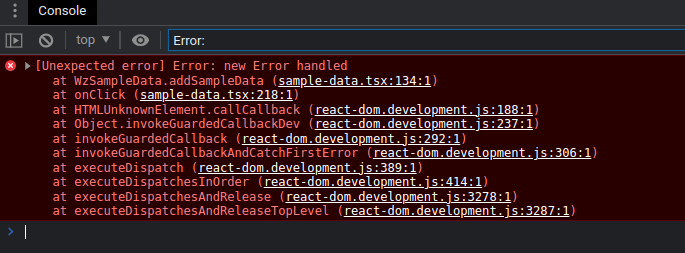

# Error handler class

The error handler class allows to the developer to manage the errors in a centralized way.
This class will receive an error instance or error message and it will classify and categorize the error by its structure and create and return the corresponding Error instance.
Also, every custom error class "WazuhError" have a proper log treatment defined inside the class.

## 1 - On component when we want to log an error catched in the try-catch block

### Scenario 1
- On a class component or a functional component
- Could be a event handler method. For instance: when the user clicks on a button.
- We want to leave the error handler auto-categorize the error and log how is defined in the respective error class.
- The error instance is a NATIVE JAVASCRIPT ERROR

```tsx
import { ErrorHandler } from 'public/react-services/error-management';

const errorMocked = new Error('new Error handled');

    class ExampleComponent extends Component {
      constructor(props: any) {
        super(props);
      }

      onClickEvent() {
        try {
          // do something
          throw errorMocked;
        } catch (error) {
          // the error handler will auto-categorize the error and log how is defined in the respective error class
          // if the error is custom (WazuhError) the handler error will return
          if (error instanceof Error) {
            ErrorHandler.handleError(error); // the error handler returns the error instance
          }
        }
      }

      render() {
        return (
          <>
            <h1>Example component</h1>
            <button onClick={this.onClickEvent}>Button</button>
          </>
        );
      }
    }

```

- If the error is a native error the handler will log the error in console using the loglevel library

]


### Scenario 2
- On a class component or a functional component
- Could be a event handler method. For instance: when the user clicks on a button.
- We want to leave the error handler auto-categorize the error and log how is defined in the respective error class.
- The error instance is a HTTP ERROR

```tsx
class ExampleComponent extends Component {
      constructor(props: any) {
        super(props);
      }

      onClickEvent() {
        try {
          // do something and throw the error
          throw errorMocked; // the error must be an http error like when use the WzRequest.genericReq || apiReq.request
        } catch (error) {
          // the error handler will auto-categorize the error and log how is defined in the respective error class
          // if the error is custom (WazuhError) the handler error will return
          if (error instanceof Error) {
            ErrorHandler.handleError(error); // the error handler returns the error instance
          }
        }
      }

      render() {
        return (
          <>
            <h1>Example component</h1>
            <button onClick={this.onClickEvent}>Button</button>
          </>
        );
      }
    }
```


- if the error is a custom HttpError the handler will log the error using the core toast service

**Toast**

]

**Toast Content**

]
